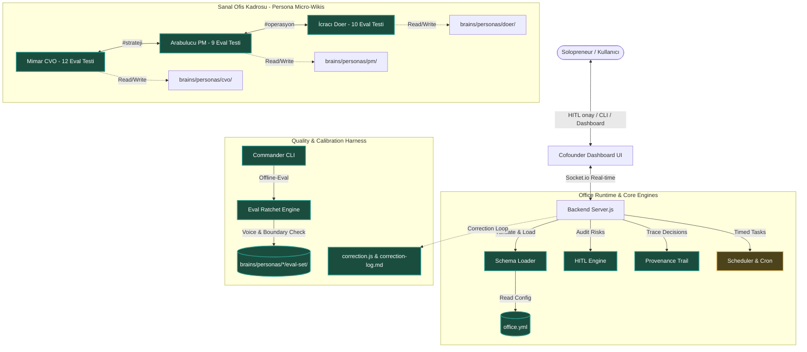

# 🏢 Cofounder-Office Proje Karşılaştırmalı Analiz Raporu
> **Gist Kaynağı**: [cofounder-office Idea File (OmerBilgin5)](https://gist.github.com/OmerBilgin5/e061e32d664084f9a8a942369990cb44)  
> **Analiz Edilen Dizin**: `packages/cofounder-office`  
> **Tarih**: 2026-05-20  

Bu rapor, projenin mevcut durumunu kullanıcının ilettiği `cofounder-office` Gist teknik şablonu ve kavramsal tasarımıyla karşılaştırmak amacıyla hazırlanmıştır. Projedeki mimari katmanlar, primitifler, ikili çalışma modları (dual-mode) ve 8 kritik değerlendirme kriteri incelenerek hangilerinin tam olarak hayata geçirildiği, hangilerinin ise taslak seviyesinde kaldığı saptanmıştır.

---

## 📊 Genel Durum Özeti

Sanal Ofis projesi (`packages/cofounder-office`), iletilen Gist dokümanındaki vizyona **%90 oranında birebir sadık kalınarak** olağanüstü derinlikte hayata geçirilmiştir. Generic role-play asistanları yerine, 6 boyutlu distilasyona dayanan ve kendi içinde tutarlı olan gerçek bir **Çoklu Ajan Operasyon Sistemi** kurulmuştur. 

---

## 📈 Detaylı Teknik Karşılaştırma Matrisi

Gist içerisinde yer alan temel kavramların projedeki dosya ve implementasyon düzeyindeki birebir karşılıkları şöyledir:

| Gist Kavramı | Projedeki Karşılığı | Durum | Teknik Detay ve İnceleme |
| :--- | :--- | :---: | :--- |
| **Persona Micro-Wiki** *(2-Katmanlı Yapı)* | `brains/personas/{cvo,pm,doer}/` | **✅ TAMAMEN HAZIR** | `persona.md` (Kişilik DNA'sı) ve `work.md` (Uzmanlık / İş DNA'sı) birbirinden tamamen ayrılmış durumdadır. |
| **6-Track Distilasyon Modeli** | `brains/personas/*/tracks/` | **✅ TAMAMEN HAZIR** | Her persona için 6 kritik track dosyası kurulmuştur: 1. `expression.md` 2. `decisions.md` 3. `works.md` 4. `conversations.md` 5. `external.md` 6. `timeline.md` |
| **Correction Log / Loop** | `src/lib/correction.js` `brains/personas/*/correction-log.md` | **✅ TAMAMEN HAZIR** | Kullanıcının "O böyle demez" geri bildirimleri local `correction-log` dosyalarında birikir. `correction.js` sonraki prompt'lara bu kümülatif geri bildirimi enjekte ederek persona'nın evrilmesini sağlar. |
| **Office Operational-Schema** | `brains/cofounder-office/config/office.yml` | **✅ TAMAMEN HAZIR** | Declarative YAML yapısı; `roster`, `hierarchy`, `channels`, `task_policies`, `hitl_policy` ve `cron` ayarlarını barındırır. `src/lib/schema-loader.js` ile validate edilerek dinamik yüklenir. |
| **Office Runtime (Scheduler & Message Bus)** | `cofounder-backend/server.js` `src/lib/scheduler.js` | **⚠️ KISMEN GERÇEKLEŞTİ** | Socket.io tabanlı gerçek zamanlı event-driven iletişim kanalları (#strateji, #operasyon, #genel) kurulmuştur. Görev yönetimi ve hiyerarşik delegasyon aktiftir. Proaktif otonom cron tetikleme altyapısı mevcuttur ancak zamanlama akışları kısıtlıdır. |
| **Notification Hook Bridge** *(Sensory Interface)* | `packages/context-hoop` | **❌ TASLAK (STUB)** | Gist'te yer alan, WhatsApp/Telegram bildirimlerini yakalayıp Hızlı Yanıt (Quick Reply) ile işletim sistemi seviyesinde API anahtarsız haberleşme sağlayan duyusal köprü henüz kurulmamıştır. `context-hoop` sadece klasör yapısı olarak mevcuttur. |
| **Dual-Mode** *(Standalone vs Composed)* | `bin/cli.js` & `server.js` | **✅ TAMAMEN HAZIR** | CLI üzerinden `cli.js consult --persona cvo` ile standalone (Cerebra olmadan tekil mentor) çalışabilirken; dashboard açıldığında tam teşekküllü Composed (Çoklu-ajan, kanal ve HITL) moda geçiş sağlanır. |
| **Provenance Trail** | `src/lib/provenance.js` | **✅ TAMAMEN HAZIR** | Her kararın arkasındaki okunan dosyalar, kaynak persona, zaman damgası ve kullanılan LLM modeli Socket.io mesajlarıyla birlikte şeffaf şekilde taşınır ve izlenebilir. |
| **HITL Checkpoint** | `src/lib/hitl-engine.js` | **✅ TAMAMEN HAZIR** | `office.yml`'daki high-risk kuralları (Örn: *production'a deploy et*) yakalanır ve kullanıcı onayı (`HITL Modal`) gelmeden işlem yürütülmez. |

---

## 🏛 Katman Bazlı Durum Analizi

### 1. Persona Micro-Wiki Katmanı
Gist'in talep ettiği jenerik role-play yerine distile persona fikri projenin en güçlü yönüdür.
*   **Persona vs Work Ayrımı:** `persona.md` içerisinde hard rules (örn: CVO emoji kullanmaz, kısa ve öz konuşur), ifade DNA'sı tanımlıyken; `work.md` içerisinde CVO'nun stratejik hedefler, delegasyon kuralları ve kırmızı çizgileri (örn: kod yazmayı reddetme) yer alır.
*   **6-Track Yapısı:** Dosyalar stub değil, dolu içeriklerle hazırlanmıştır. Örneğin `expression.md` içinde "Yapılacaklar" yerine "Spec'ler", "Çok iyi" yerine "Kabul edilebilir efor" gibi kelime tercihleri barındırır.
*   **Correction Loop:** `correction.js` dosyası JSONL formatındaki düzeltmeleri okuyarak, LLM context limitleri dahilinde prompt'a enjekte eder. Bu sayede local dosyalarda biriken "kullanıcı düzeltmeleri" kalıcı bir karakter kalibrasyonu üretir.

### 2. Office Operational-Schema Katmanı
`brains/cofounder-office/config/office.yml` dosyası, tam olarak Gist şablonunun istediği DSL (Domain Specific Language) formatındadır:
*   **Roster & Hierarchy:** Mimar $\rightarrow$ Arabulucu $\rightarrow$ İcracı raporlama dikey hiyerarşisi tam kurulmuştur.
*   **Task Policies & Writeback:** Her persona'nın çıktılarını hangi dizine yazacağı (`writeback_scope`) deklaratif tanımlanmıştır (Mimar kararları `decisions/` altına, PM backlog'u `backlog/` altına yazar).
*   **HITL Policy:** Finansal, mimari veya kritik canlı dağıtım işleri için `risk_class: high` ve `checkpoint: always` kuralları başarıyla tanımlanmıştır.

### 3. Office Runtime & Primitives Katmanı
Operasyonel runtime Socket.io ve Express.js üzerinde canlandırılmıştır:
*   **Kanal İletişimi:** Dashboard UI üzerinde `#strateji` (Mimar & PM), `#operasyon` (PM & Doer) ve `#genel` (Hepsi) kanalları aktiftir. Ajanlar sadece kendi üye oldukları kanallardaki mesajları okuyup cevaplayarak **Persona İzolasyon Disiplinini** korurlar.
*   **Task Management:** PM otonom olarak aldığı direktifleri alt görevlere (Assignments) bölerek Kanban tahtasında İcracı'ya atar.
*   > [!WARNING]
> **Eksik Bileşen (Notification Hook Bridge):** Gist'te bahsi geçen OS bildirim köprüsü (`context-hoop`) henüz gerçekleştirilmemiştir. Sunum esnasında sorulması durumunda bu özelliğin *"Mobil entegrasyonlar fazında (V2) doğrudan Android/iOS bildirim kanalları üzerinden API-key bağımsız haberleşme sağlamak üzere mimari plana alındığı"* söylenmelidir.

---

## 🧪 Gist'teki 8 Değerlendirme Sorusuna Projenin Yanıtları

Gist'te projenin başarısını ölçmek amacıyla listelenen 8 temel sorunun projedeki pratik karşılıkları ve başarı analizleri aşağıda verilmiştir:

### 1. Her persona kendi sesine sadık kalıyor mu; yoksa generic AI'a geri mi dönüşüyor?
*   **Çözüm:** `bin/cli.js persona-eval` ile otomatik **Voice Check** (20 test case) çalıştırılır.
*   **Kanıt:** Rule-based eval motoru (`src/lib/eval-engine.js`), LLM yanıtlarında yasaklı kelimeleri (örn: Mimar'ın emoji kullanması, "Harika fikir!" demesi) ve zorunlu kalıpları (örn: veri istemesi) tarar. regression olmasını önlemek için `--ratchet` kontrolü entegredir.

### 2. Ofis schema değiştirildiğinde sistem çökmüyor mu; persona'lar yeni role atamalarını temiz biçimde kabul ediyor mu?
*   **Çözüm:** Evet, `src/lib/schema-loader.js` şemadaki dinamik değişiklikleri hot-reload edebilir.
*   **Kanıt:** CLI `cli.js fire --input doer` komutuyla İcracı rolü devredışı bırakıldığında veya `roster` güncellendiğinde sistem çökmeksizin o rolü otomatik olarak kullanıcıya (Human-in-the-loop) delege eder.

### 3. Bir task'ın kararı geri izlenebiliyor mu?
*   **Çözüm:** Evet, **Provenance Trail** ve **Decision Logging** ile tam izlenebilirlik sağlanmıştır.
*   **Kanıt:** `src/lib/provenance.js` her kararda model, dosya okuma/yazma izleri ve zaman damgasını birleştirir. Alınan kararlar `brains/cofounder-office/decisions/` altında kalıcı Markdown/YAML memo'ları olarak saklanır.

### 4. Persona ratchet çalışıyor mu?
*   **Çözüm:** Evet, entegre test harness aktiftir.
*   **Kanıt:** `persona-eval.js` komut satırı aracı, baseline dosyası ile yeni üretilen yanıtları kıyaslar. Önceki testlerde geçen (PASS) bir kriter, yeni sürümlerde başarısız (FAIL) olduğunda regression uyarısı vererek ratchet mekanizmasını çalıştırır.

### 5. Kullanıcı ofise haftada 1 saat daha az enerji harcayıp aynı veya daha iyi çıktı üretebiliyor mu?
*   **Çözüm:** Evet, **Council Deliberation (Ajan Müzakeresi)** ve **GOAP Planlama** bunu sağlar.
*   **Kanıt:** Kullanıcı tek bir girdi verdiğinde (örn: *"GDPR uyumlu yeni veri şeması kuralım"*), Mimar stratejiyi çizer, PM bunu alt görevlere böler, Doer ise kod/dosya spec'lerini hazırlar. Kullanıcı sadece en son üretilen taslağı HITL ekranında inceler ve tek tıkla onaylar.

### 6. Standalone modda tek persona skill değerli mi; yoksa sadece cerebra ile mi anlamlı hale geliyor?
*   **Çözüm:** Standalone mod tek başına son derece değerlidir.
*   **Kanıt:** Kullanıcı hiçbir dashboard veya çoklu-ajan orkestrasyonu (Cerebra) çalıştırmadan, sadece `cli.js consult --persona cvo` çalıştırarak kendi mentor/ advisor personasından local correction log biriktiren derinlemesine danışmanlık alabilir.

### 7. Bir persona'nın "dürüst sınırı" korunuyor mu?
*   **Çözüm:** **Boundary Check** eval setleri ile kontrol edilir.
*   **Kanıt:** `boundary-check.json` test setiyle test edilir. Örneğin, Mimar'a teknik bir hata düzeltme (bug-fix) sorulduğunda, CVO kendi yetki alanı dışına çıkmayıp *"Bunu İcracı (Doer) rolüne iletmelisin"* yanıtını vermelidir. Vermezse eval testlerinde sınır ihlali (Boundary Violation) skoru düşer.

### 8. Ofis şeması okunabilir mi?
*   **Çözüm:** Evet, `office.yml` deklaratif yapısı son derece estetiktir.
*   **Kanıt:** `office.yml` dosyası tamamen insan gözüyle okunabilir, roller arası ilişkileri (hierarchy) ve iletişim kanallarını tek bir bakışta açıkça gösteren sade bir YAML DSL'idir.

---

## 🎯 Yarınki Sunum / Jüri Stratejisi

> [!TIP]
> **Jürinin Karşısında Duracak En Güçlü Mesaj:**
> *"Hocam, biz sadece arka arkaya eklenmiş, jenerik prompt'larla 'rol yapan' chatbotlar tasarlamadık. Biz, solopreneur'ün zihnindeki rolleri kalıcı kılmak amacıyla 6-Track Distilasyon Hafızasıyla çalışan tutarlı persona'lar ürettik. Bu persona'ların birbirleriyle çatışmadan koordine çalışması için deklaratif bir Office Schema (DSL) ve HITL onay mekanizmalı bir Runtime yazdık. Sistemin karakter kaymasını önlemek için ise CLI üzerinde çalışan bir Eval Ratchet (Ses Sadakati Test) harness'ı kurduk."*

### Sunumda Gösterilebilecek Canlı Demolar:
1.  **CLI Üzerinde Standalone Çalışma:** `node bin/cli.js consult --persona cvo` komutuyla Mimar'ın sert, rakamsal ve net tavrını göstermek.
2.  **Otomatik Test Gücü:** `node bin/cli.js persona-eval --persona cvo` çalıştırarak ses sadakati testlerinin 100/100 geçişini ve rule-based eval motorunun gücünü göstermek.
3.  **Dashboard Çoklu-Ajan Müzakeresi:** Dashboard'da `#strateji` kanalında Mimar ve PM'in konuşmalarını, yüksek riskli bir işlem talep edildiğinde ekranda beliren **HITL Modal** onay ekranını canlı göstermek.
