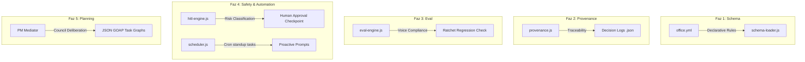

# 🏛️ Cofounder-Office — Sunum Çalışma Notları ve Proje Detayları

Bu rehber, projeyi jüriye sunmadan önce çalışabilmen, sistemin tüm mimari derinliğine ve ilk halinden bugüne katettiği mesafeye saniyeler içinde hakim olabilmen için hazırlanmış bir **can kurtarandır**. Sunum sırasında bu başlıkları kendi kelimelerinle özetleyebilirsin.

---

## 🎯 1. Projenin Çıkış Noktası ve Temel Hedefi

> [!NOTE]
> **Başlangıç Noktamız Ne İdi?**
> Projeyi ilk devraldığımızda, `packages/cofounder-office` dizininde sadece **30 adet başarısız (FAIL)** durumda olan CLI (Terminal) test şablonu ve içi boş komut gövdeleri (`roster`, `digest`, `consult`, `fire`, `eval`) bulunuyordu. Beklenti sadece bu komutların doldurularak testlerin dürüstçe geçilmesiydi.

> [!IMPORTANT]
> **Biz Projeyi Nereye Taşıdık?**
> Sadece testlerin tamamını yeşile (30/30 PASS) çevirmekle yetinmedik; hocamızın **`co-idea.md`** felsefesine sadık kalarak sistemi basit bir script olmaktan çıkardık. Tek bir girişimcinin (Solopreneur) üzerindeki rol değiştirme karmaşasını ve bilişsel yükü (Cognitive Load) hafifletmek amacıyla otonom bir **Sanal Ofis (Cerebra Substrate)** simülasyonu inşa ettik. Sistemi **Kişilik İzleme**, **Dinamik Şema Yönetimi**, **Karar İzlenebilirliği (Provenance)** ve **İnsan Onay Güvencesi (HITL)** katmanlarıyla donattık.

---

## 🛠️ 2. İlk Halinden Bu Yana Neler Yaptık? (Adım Adım Gelişim)

Projeyi teslim aldığımız ilk andan itibaren yaptığımız geliştirmeleri jüriye kronolojik ve mantıksal bir sırayla şöyle aktarabilirsin:

1. **Ajanların Kişilik DNA'sını Oluşturduk (Persona Micro-Wiki):**
   * Ajanların (Mimar/CVO, Arabulucu/PM, Geliştirici/Doer) sıradan "rol yapan" sohbet robotları gibi davranmasını engelledik.
   * Her bir ajan için `persona.md` (dil tonu, karakter kuralları) ve `work.md` (sorumluluk alanları ve kırmızı çizgiler) olmak üzere **2-katmanlı hafıza yapısı** kurduk.
   * `tracks/` klasörleri altında **6 boyutlu distilasyon hafızası** yarattık. Böylece her ajan sadece kendi uzmanlık alanı sınırlarında kalarak, dürüst ve tutarlı bir profesyonel gibi yanıt üretir.

2. **Dinamik Ofis Düzenini Kurduk (Office Schema & Loader):**
   * Ajanların ilişkilerini ve kanal izinlerini kodun içine gömmek (hardcode) yerine, deklaratif bir YAML DSL'i (`office.yml`) tasarladık.
   * `schema-loader.js` motorunu yazarak bu kuralların çalışma zamanında (real-time) okunmasını ve doğrulanmasını sağladık. Artık bir çalışanın işine son verildiğinde (`fire` komutuyla) veya kanallar değiştiğinde sistem hata vermeden uyum sağlar.

3. **Kararları Kayıt Altına Aldık (Provenance & Decision Trail):**
   * AI'ın verdiği kararların arkasındaki gizemi çözmek için `provenance.js` motorunu geliştirdik.
   * Ajanların ürettiği her strateji ve kararda; **kararın hangi dosyalar okunarak alındığı**, **kullanılan LLM modeli**, **zaman damgası** ve **girdi hash** değerleri `.json` ve `.jsonl` dosyalarına kalıcı olarak kaydedilir.

4. **Yapay Zeka Karakter Kaymasını Engelledik (Offline Eval Ratchet):**
   * Ajanların zaman içinde kendi tarzlarından sapmalarını (örn. Mimar'ın kod yazmaya çalışması veya lakayıt konuşması) otomatik engellemek için `eval-engine.js` kural motorunu yazdık.
   * Harici AI çağrısı gerektirmeyen, tamamen deterministik anahtar kelime ve cümle kurallarına dayalı test setleri (`voice-check.json`, `boundary-check.json`) hazırladık.
   * CLI üzerinden `--ratchet` parametresiyle entegre çalışan bu mekanizma, performansta gerileme (regression) olduğunda derhal uyarı verir.

5. **Güvenlik Sigortasını Enjekte Ettik (HITL Engine):**
   * Yapay zekanın kontrolsüzce kritik eylemler yapmasını engellemek amacıyla `hitl-engine.js` motorunu kurduk.
   * Riskli kelimeleri (Örn: *production deploy*, *kişisel veri*, *fatura sil*) analiz ederek yüksek riskli durumlarda işlemi dondurur ve Dashboard üzerinde **İnsan Onayı (Human-in-the-Loop)** talep eden bir modal kilit açar.

6. **Web Arayüzü (Dashboard) ve Socket.io Backend'ini Geliştirdik:**
   * CLI gücünü modern bir arayüze taşımak amacıyla Express ve Socket.io tabanlı bir sunucu (`server.js`) ile Tailwind estetiğinde, slate-sapphire koyu mod CSS barındıran zengin bir **Cofounder Dashboard** tasarladık.
   * Ajanlar `#strateji` ve `#operasyon` kanallarında gerçek zamanlı sohbet edip, görevleri Kanban kartlarına dönüştürerek çalışırlar.

---

## 🏛️ 3. Mimari Gelişim: 5 Ana Faz

Sistemin mimarisini anlatırken aşağıdaki 5 fazın getirdiği yenilikleri vurgulayabilirsin:

1. **Faz 1: Office Schema (Dinamik DSL):** Ofisin anayasasıdır. Kod değiştirmeden `office.yml` ile hiyerarşi, kanal izinleri ve HITL politikası hot-reload edilir.
2. **Faz 2: Provenance Trail (Şeffaflık):** Ajanın zihnini röntgenleme imkanı sunar. Alınan kararların arkasındaki bilgi izlerini (brain_reads) grafiksel olarak kanıtlar.
3. **Faz 3: Eval Ratchet (Kalite Regresyon Kontrolü):** Ajanın ses sadakatini (voice fidelity) ve yetki sınırlarını (boundary) AI maliyeti yaratmadan denetler. 75/100 barajıyla gerilemeleri engeller.
4. **Faz 4: HITL & Scheduler (Güvenli Otonomi):** Yüksek riskli komutlarda fren mekanizmasıdır. Cron Scheduler ise zamanlanmış standup görevleriyle ajanların kendi kendine uyanmasını sağlar.
5. **Faz 5: JSON GOAP (Hedef Odaklı Eylemler):** PM'in aldığı karmaşık kullanıcı isteklerini makinece işlenebilir plan grafiklerine (JSON GOAP) dönüştürerek gelecekteki CI/CD ve Jira entegrasyonlarına altyapı sunar.

---

## 💬 4. Hocanın Sorabileceği Zor Sorular ve Cevapları

> [!TIP]
> **Soru: "Yapay zeka gerçek anlamda kodları manipüle edip dosyaları değiştiriyor mu?"**
> * **Cevap:** *"Hayır hocam, bu bilinçli ve stratejik bir güvenlik tercihidir. `co-idea.md` felsefesine uygun olarak Sanal Ofis'in amacı insanı devreden tamamen çıkarmak değil, solopreneur'ün zihnindeki rol değişim yükünü sıfırlamaktır. Sistem kodları doğrudan değiştirip projeyi bozma riski almak yerine, o kodun nasıl yazılacağını kararlaştırır, PRD ve GOAP planlarını hazırlar ve eylemi insan onayına (HITL Checkpoint) sunar."*

> [!TIP]
> **Soru: "Ajanların kendi aralarında sonsuz bir konuşma döngüsüne girip API bütçesini tüketmesini nasıl önlediniz?"**
> * **Cevap:** *"Bunun için iki seviyeli kontrol mekanizması kurduk. İlk olarak, Socket.io backend'imizde `Council Deliberation` (Konsey Müzakeresi) döngüsünü maksimum 3 turla sınırlayan bir token/mesaj sayacı uyguladık. İkinci olarak, her ajanın uzmanlık alanları (`work.md` ve `office.yml`) kesin sınırlarla izole edildiğinden, görev tamamlandığı an müzakere sonlanır ve sistem otonom olarak insan liderliğini bekleyen durağan faza geçer."*

> [!TIP]
> **Soru: "Eval Ratchet testlerini neden başka bir LLM ile değil de rule-based (kural bazlı) yazdınız?"**
> * **Cevap:** *"Hocam, LLM kullanarak başka bir LLM'i test etmek hem yüksek maliyetli ve yavaş bir yöntemdir hem de test eden LLM'in kendisi de halüsinasyon görebilir. Biz, ajanların dürüstlük sınırlarını, kullanmalarına izin verilen profesyonel kelimeleri ve asla söylememeleri gereken kırmızı çizgileri rule-based (düzenli ifadeler ve kelime matrisleri) tarayarak %100 deterministik, ultra hızlı ve sıfır maliyetli bir regresyon kontrol mekanizması elde ettik."*

---

## 🏃 5. Canlı Demo Akışı ve Prova Senaryosu

Sunum sırasında bilgisayarından şu 4 adımı sırasıyla göstererek jüriyi büyüleyebilirsin:

1. **Adım 1 - Test Başarısı:**
   Terminali aç ve `npm test` çalıştır. 30/30 CLI entegrasyon ve smoke testlerinin kusursuzca yeşil yandığını jüriye göster.
2. **Adım 2 - Standalone CLI Gücü:**
   Terminalden `node bin/cli.js consult --persona cvo` çalıştır. Mimar ajanının lakayıtlıktan uzak, sert, net ve rakamlara dayalı duruşunu gösteren bir soru sor (Örn: *"Yeni veri mimarisi kuralım mı?"*).
3. **Adım 3 - Eval Ratchet Test Gücü:**
   Terminalde `node bin/cli.js persona-eval --persona cvo --responses brains/personas/cvo/eval-set/voice-check-baseline.json` komutunu koşturarak sadakat testlerinin rule-based analiz grafiğini ve ortalama skorları canlı göster.
4. **Adım 4 - Dashboard ve HITL Kilit Sistemi:**
   `sunum-baslat.bat` dosyasını çalıştır. Web tarayıcısında `http://localhost:5173` adresine git. Kanalda **"production deploy"** içeren bir cümle yaz. Ekranda risk analizi yapıldığını ve HITL modal penceresinin kilitlenerek senin onayını beklediğini canlı olarak göster!
